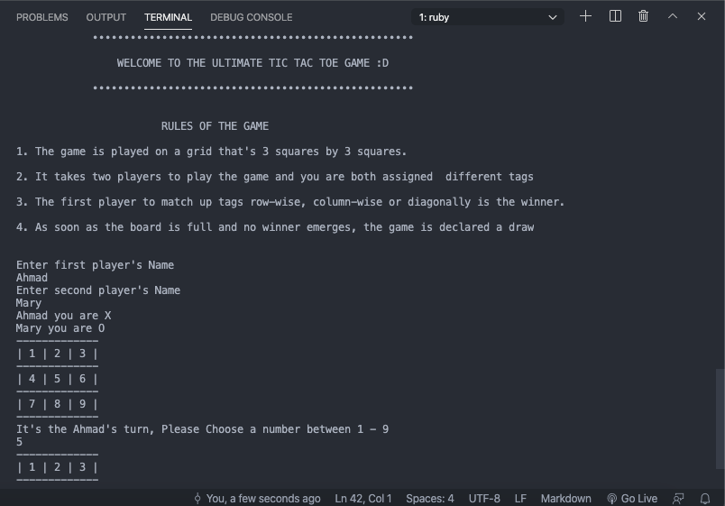
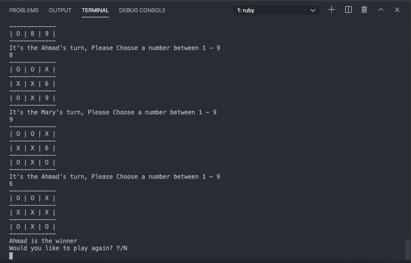

## Tic-Tac-Toe Game
This application is a command line implementation of the classic Tic tac toe game.

[](https://github.com/Maryjanee/Tic-Tac-Toe/tree/game-logic)
[](https://github.com/Maryjanee/Tic-Tac-Toe/issues)
[](https://github.com/Maryjanee/Tic-Tac-Toe/pulls)

## Content

<a text-align="center" href="#about">About</a>&nbsp;&nbsp;&nbsp;|&nbsp;&nbsp;&nbsp;
<a href="#how_to">How to Play</a>&nbsp;&nbsp;&nbsp;|&nbsp;&nbsp;&nbsp;
<a href="#screen">Screenshot</a>&nbsp;&nbsp;&nbsp;|&nbsp;&nbsp;&nbsp;
<a href="#ins">Installing</a>&nbsp;&nbsp;&nbsp;|&nbsp;&nbsp;&nbsp;
<a href="#set">Setup</a>&nbsp;&nbsp;&nbsp;|&nbsp;&nbsp;&nbsp;
<a href="#with">Built with</a>&nbsp;&nbsp;&nbsp;|&nbsp;&nbsp;&nbsp;
<a href="#ldl">Live Demo</a>&nbsp;&nbsp;&nbsp;|&nbsp;&nbsp;&nbsp;
<a href="#author">Author</a>

## About <a name = "about"></a>

This project was completed under microverse remote software development curriculum. The requirement was to create a Tic-Tac-Toe game.

## Screenshot <a name = "screen"></a>






## 🔧 Built with<a name = "with"></a>

- Ruby

## 🔴 Live Demo <a name = "ldl"></a>

[](https://repl.it/)

## 🔨 Setup <a name = "set"></a>

- Fork the repo to your remote repository.
- Clone or download the repository to a local directory on your computer.

## 🛠 Installing <a name = "ins"></a>

- run npm install to install the dependencies for the project
- run bundle init to create a Gemfile
- run bundle install to install the gems

## How to Play <a name = "how_to"></a>

- Install Game.
- Open a terminal and cd into the game directory
- Type ```bin/main.rb``` in the terminal and hit enter.

Tic-tac-toe (American English), noughts and crosses (British English), is a game for two players, and each of the players are assigned tags(X and O), each player take turns marking the spaces in a 3×3 grid with their assigned tag. The player who succeeds in placing three of their tag in a horizontal, vertical, or diagonal row is the winner.

In order to win the game, a player must place three of their marks in a horizontal, vertical, or diagonal row.

## ✒️ Authors <a name = "author"></a>

👤 **Maryjane Akpagbue**

- Github: [maryjanee](https://github.com/Maryjanee)
- Twitter: [Maryjane Akpagbue](https://twitter.com/alfredmaryjane)
- Linkedin: [Maryjane Akpagbue](https://www.linkedin.com/in/maryjane-akpagbue-1500b7173/)

👤 **Ahmad Chata**

- Github: [ahmadchata](https://github.com/ahmadchata)
- Twitter: [ahmadchata](https://twitter.com/ahmadchata)
- Linkedin: [Ahmad Chata](https://www.linkedin.com/in/ahmad-chata-957b9b51/)

## 🤝 Contributing

Contributions, issues and feature requests are welcome!

Feel free to check the [issues page](https://github.com/Maryjanee/Tic-Tac-Toe/issues).

## 👍 Show your support

Give a ⭐️ if you like this project!

## :clap: Acknowledgements

- Microverse
- The Odin Project
